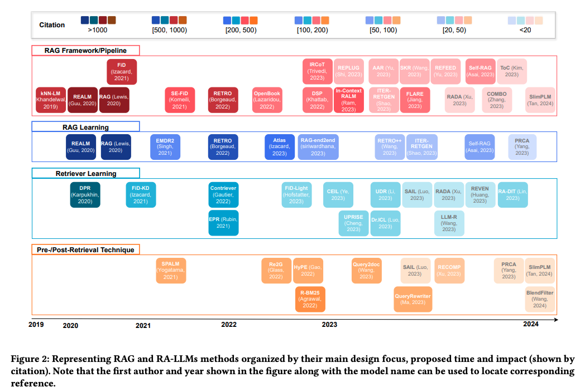
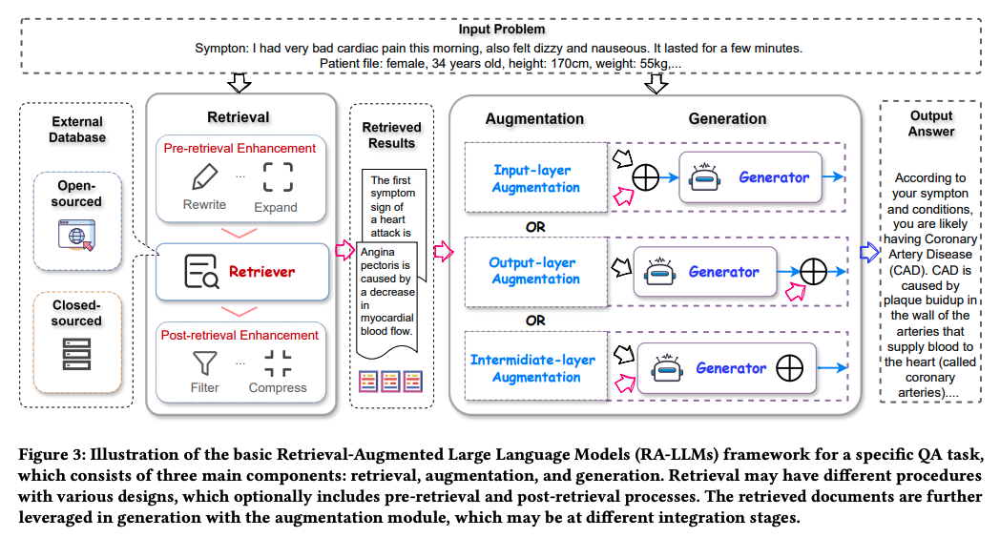
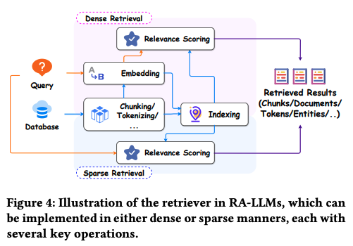
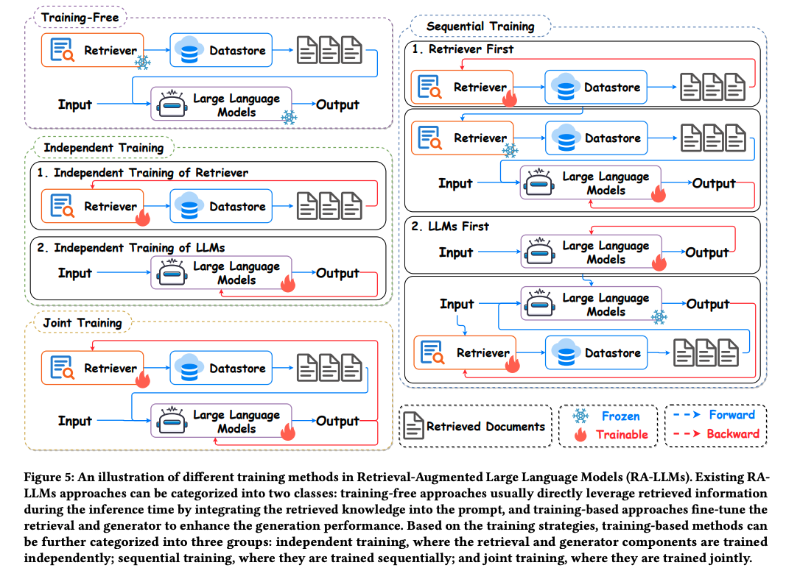
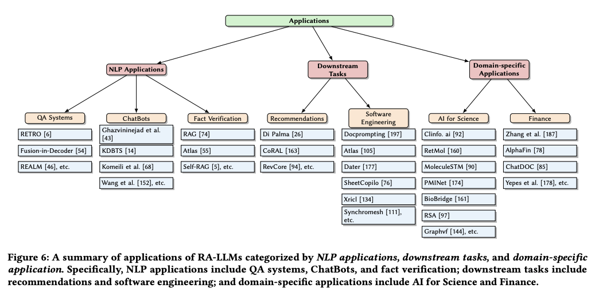

```
==============
A Survey on RAG Meeting LLMs
==============
```

The paper link at 
- https://dl.acm.org/doi/10.1145/3637528.3671470
- https://advanced-recommender-systems.github.io/RAG-Meets-LLMs/



***LLMs architectures***
- From Encoder (BERT): bi-directional encoder => well-understand the context/semantic of words => good at sentiment analysis, conversation/dialog
- From Decoder (GPT families): is trained on auto-regression => text generation
- From Encoder-Decoder (T5): complex text generation problems

*Limitations of RAG*
- Hallucinations: incorrectly factual problem, non-sensical, misleading information if retrieving the unnescessary knowledges => need to evaluate when incoperate the retrieved information with prior-knowledge

# Retrieval - Augmented Large Langugage Models (RA-LLMs)

Example of framework RAG-LLMs in QA task


There are three components:
### Retrieval: dense vs sparse retrieval
- dense retrieval: word/BoW/TF-IDF/BM25 => compact meaning 
- sparse retrieval: indexing => haviely storage => searching faster.

- Retrieval Results:
    - chunk results: passages
    - token results: fast queries + apply in cases of rare pattern or out-of-domain

- Strategy: pre / post
    - Pre-retrieval: enhancing query by generating pseudo-document/ hypothetical document/ rewrite the query with more conducive questions
        - queries expansion (Query2doc)
        - HyDE method: Hypothetical Document Embedding
        - rewrite query: clarify the retrieval need in the new query
        - *query augmentation*: combine original query and preliminary generated outputs as a new query => retrieve relevant information from the external database => **good strategy of the query enhancement**.
    - Post-retrieval: process the extracted top-k documents from retriever before feeding them into generator
        - Retrieve-Rerank-Generate ($R^2$ G) => ranking the retrieved documents from the different retrieval approaches => boosting the robustness of the retrieval results
    - Fixing the preventing long retrieved documents => compress the retrieved documents into a smaller document/summary
        - Retrieve, Compress, Prepend (RECOMP) => add model/intermediate layers to transform the retreived documents into textual summary before feeding into the generation process.
        - FiD (Exploring the Multi-document Reader for Prompt Compression)
- Database:
    - Option key-value: keys for similarity matching (likely sparse vectors for BM25 or dense embeddings from retrieval encoding); value mostly is raw-text.

### Generation
- White box: parameter accessible generators
    + Can access/concat parameters in/from Encoder/ Encoder-Decoder to enhance the generation accuracy and relevance.
    + Example: Retrieval-Augmented Generation for Knowledge-Intensive NLP Tasks (https://arxiv.org/pdf/2005.11401)

- Black box: parameter-inaccessible generator
    + Can't access/alter the parameters, insteading feeding the input to models (GPT, Gemini, etc) and recieve the response
    + Difficult to tune the closed LLM models with a small dataset
    + Purpose: focus more to enhance the generation process by augmenting the inputs in a term of context prompting


### Augmentation: augmented at the layers of input / output / middle

- Describe the technical process that integrates retrieveal and generation parts.
- There are types of cates

#### Input-Layer integration
- A common way: integrate retrieved information/docs to original query and then jointly pass them/or demonstration to the generator => boosting the zero-shot ability of LLMs without delicate prompt engineering
- *Limitation*: long retrieved document in the context prompting => solution: remove some tokens, run parallelly each retrieved with original question
- Examples: RALM paper

#### Output-Layer integration
- Jointly integrate the retrieval and generation results.
- Examples: kNN-LM interpolates two next-token distribution in inference: one by LM and other induced by the nearest neighbors from retrieval corpus
- Examples: Improving language models via plug-and-play retrieval feedback (https://arxiv.org/pdf/2305.14002)

#### Intermediate-Layer integration
- Aka: a semi-parametric module to integrate the retrieved results + the internal layers of the generation models.
- Examples: RETRO - Improving language models by retrieving from trillions of tokens (https://arxiv.org/abs/2112.04426)

# Training RA-LLM
- Train-free approach: insert the retrieved knowledge into prompting in the inference phase => retriever and generator is optmized for downstream tasks
- Training-based approach: fine-tune the retreiver and generator with exploiting the external knowledge



#### Train-free approach
- In-Context RALM (https://arxiv.org/pdf/2302.00083): In-Context Retrieval-Augmented Language Models
- Retrieval-guided token generation methods: Generalization through Memorization: Nearest Neighbor Language Models (https://openreview.net/pdf?id=HklBjCEKvH)
- #### Training-based approach
- Looking at RA-LLMtraining.png

# Application
