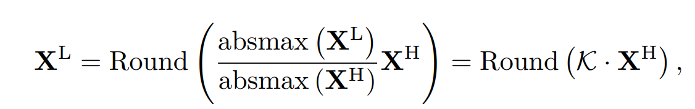
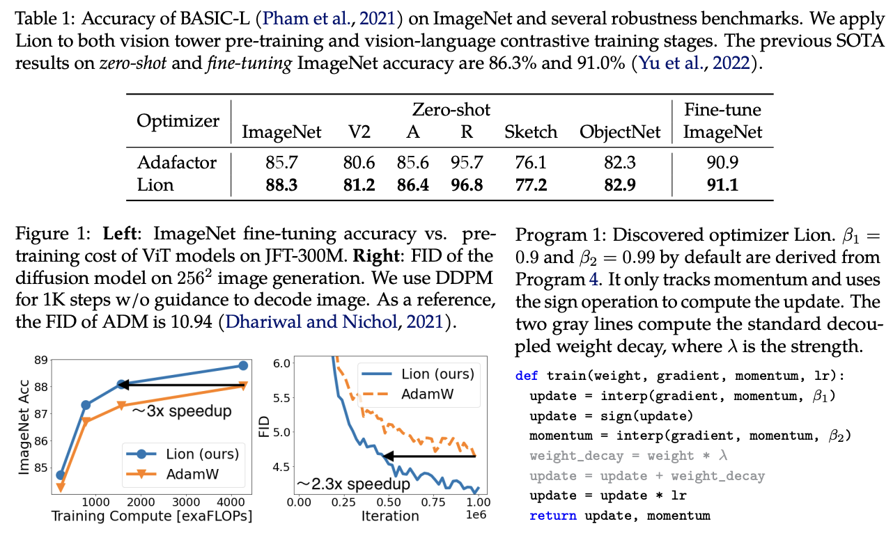
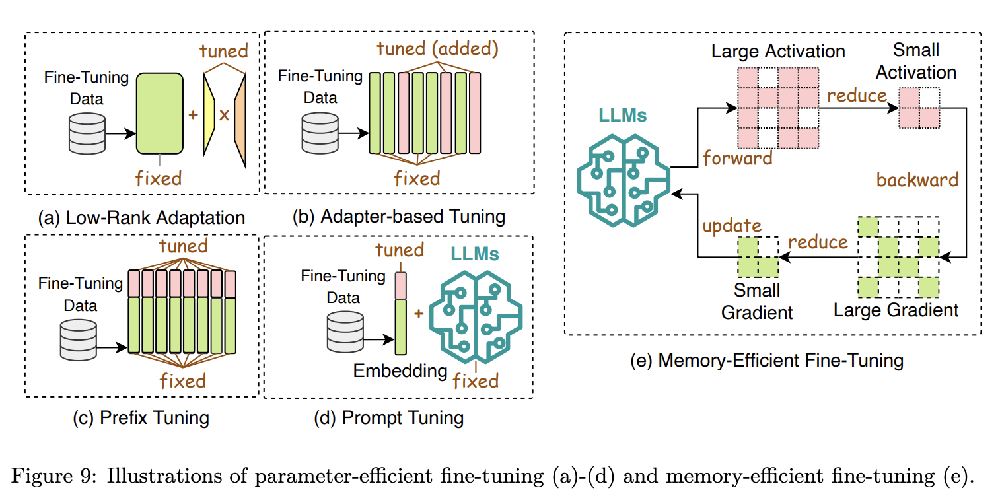

# I. Model Compression

- Purpose: reduce the size and amount of arithmetic operations.
- Compression: is designed in the post-training setting to avoid resource-intensive retraining.
- There are some categories: a) quantization, b) parameter pruning, c) low-rank approximation, d) knowledge distillation

## A. Quantization => super achievement to compression - accuracy tradeoff

- Convert the MODEL WEIGHT OR ACTIVATION of high-precision data type (X^H) into low-precision data type (X^L): 32-bit floating point -> 8-bit as using Round function with K denotes the quantization constant.
- There are two types of compression: *Post-Training Quantization (PTQ)* vs *Quantization-aware training (QAT)*.

#### Post-Training Quantization (PTQ)

- quantize the model after training.
- need a small test/calibration dataset in the testing/inference phase to update either the quantized model weights or activations
- applying the layer/outlier/channel wise technique to quantize the weight or activation.

#### Quantization-aware training (QAT)

- quantize the model during training => LLM can learn quantization representation. Using a full train-set take more time and expensive.
- QAT together Distillation to transfer and quantize the Student model. For examples, QuanGPT
- Mostly LLMs models are using the transformer backbone so there are some works apply the quantized on key-value cache.

## B. Parameter Pruning

- **Structure Pruning** the less important weights structural patterns as group of consecutive parameters or hierarchical/column/row/blocks/sub-blocks
- LLM-Pruner use a small dataset to obtain the weight / group of important of Llama and use LoRA to recovery accuracy after pruning
- **Unstructure Pruning**:

## C. Low-rank Approximation

- Approximating LLM weights W mxn with a low-rank matrices U x V

## D. Knowledge Distillation

- White-box KD: parameters / logits of Teacher distilled to Student
- Black-box KD: output of LLM Teacher distilled to Student

# II. Efficient Pre-training

#### Mixed Precision Training

#### Scaling Model

#### Initialization Techniques

#### Training Optimizers

- Lion (EvoLved Sign Momentum): is more memory - efficient than Adam and more accurate than Adam too.
  

#### System Level Pre-Training Effciency Optimization

# 3I. Efficient Fine-Tuning

### Parameter-Efficient Fine-tuning

#### Low-rank Adaption:

- LoRA: Low-rank adaption:

#### Prefix Tuning

- Adding a series of trainable vectors to each layer in LLM that tailors to specified/downstream tasks

#### Prompt Tuning

- Incorporate trainable prompt token only at the input layer => it outperforms few-shot learning ???

#### Adapter Tuning

# 3I. Efficient Architecture Design

#### Efficient Attention

- Sharing based Attention. Accelerate attention computation during inference through KV heads sharing. Llama-2: optimizes the autoregressive decoding processing using multi-query attention (**Fast Transformer Decoding: One Write-Head is All You Need**) and group-query attention (**GQA: Training Generalized Multi-Query Transformer Models from Multi-Head Checkpoints**)

#### Mixture of Experts (MoE)

- Concept: segmenting a designated task into sub-tasks and then develop many specialized models (experts) who can do the subtask. Finally those experts collaborate to deliver a consolidated output.
- For pre-train or fine-tune, MoE acquires a large of parameters managed efficiently for both performance and computation

#### Transformer alternative Architectures

- SSM models
- Receptance Weighted Key Value

# 4I. Data Centric Methods - Data Selection

# 5I. LLM Framework

- DeepSpeed by Microsoft: training + finetuning + serving LLM model
- Megatron by Nvidia: training + finetuning + serving LLM
- Nanotron by HuggingFace
