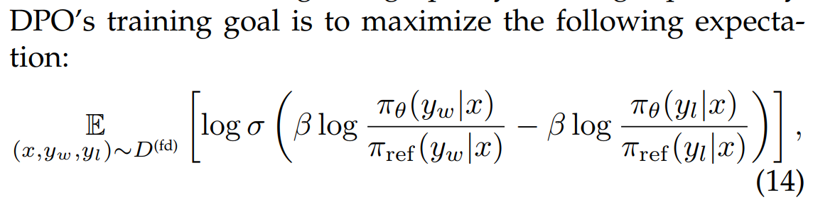

Paper: A survey on Knowledge Distillation of Large Language Models

# I. REVIEW

### **How to self-improvement in LLM to SLM**

### Pipeline of Distillation in LLM

Seed Knowledge: small specified dataset to train Student model which need to leverage knowledge reasoning from Teacher

Skill/Domain: task needs Student model to master

Leaning Objective: optimize a gap of Teacher vs. Student

The idea Fig.4 is formulated by two equations

- elicite knowledge D_I = {Parse(o,s) | o ~ P_T(o |  I concat s ), s \belong S  }:  s is seed knowledge; output from teacher LLM; I is instruction
- leaning objective L = \sum_{I} L(D_I} ; \theta_S ): \theta_S is Student

## A. KNOWLEDGE

##### Labelling: Teacher labels the output y for a given input x as the seed knowledge according to the instruction I or demonstration c => where c = (x1, y1),..,(x2,y2)....

- D^label = {x,y | x ~ X, y ~ P_T(y| I \concat c \concat x) }

=> Papers: be more understanding in FLAN v2 and teacher LLM in **Orca**: https://arxiv.org/pdf/2306.02707, https://arxiv.org/pdf/2311.11045

- FLAN v2 and teacher LLM in Orca:
- Guiding labeling is chain-of-thought (CoT) prompting
- Adding multiple system messages

*Limitation of Labelling*: scary of volumn and variety of the input data + data privacy

##### Expansion: add the in-context learning to generate data similar to the provided demonstration c => generate large volumn and variety of sampling while labelling use the sample x only

- D^exp = { (x,y) | x ~ P_T(x | I \concat c ), y ~ P_T(y | I \concat x }
- Some papers: Self-Instruct, **AugGPT** (https://arxiv.org/pdf/2302.13007)

##### Data Curation

- D^cur = { (x,y) | x ~ P_T(x | I \concat m ), y ~ P_T (y | I \concat m )    }
- Some papers: **UltraChat** (https://arxiv.org/pdf/2305.14233), **UltraLLaMA,** and **Microsoft Phi-3/-4**

##### Feature Extraction

- D^feat = { (x,y,\\phi_feat(x,y;\\theta_T)  | x ~ X, y ~ Y)  }
- Some papers: **FuseLLM** ,**Arcee’s MergeKit** (https://arxiv.org/pdf/2403.13257)

##### Guide

##### Feedback

## B. DISTILLATION

### Supervised Fine-Tuning (SFT)

- Be simplest and the most effective in Distillation approach
- Maximize the likelihood of sequences generated by the teacher LLMs, aligning the student's prediction with those of the teacher
  
- Some papers: **Large Language Models can self-improve** (https://arxiv.org/pdf/2210.11610), **Standford Alpaca** (https://crfm.stanford.edu/2023/03/13/alpaca.html), **WizardMath** (https://arxiv.org/abs/2308.09583)

### Divergence (focus on Features: distribution and hidden state features)

=> Student P_S will cover all distribution from Teacher P_T

### Similarity

Currently, this approach of similarity from encoder of Teacher vs. Student is not explored widely.

- Some papers: **MixKD: Towards Efficient Distillation of LLM** (https://arxiv.org/pdf/2011.00593)

### Distilled Reward Model Training

They use a pair of data (x,y_win, y_loss), r: reward model.

### Reinforcement Learning Optimization

a policy \phi is optimized to maximize the expected reward as per the trained reward models.

- Some papers: **Reward design with Language Models** (https://arxiv.org/pdf/2303.00001)

### Ranking Optimization

- Injecting preference feedback into language models.
- Incorperating ranking information into language models from a fixed preference dataset during fine-tuning.
- Some papers: **Self-rewarding language models** (https://arxiv.org/pdf/2401.10020)

- Some papers: **Preference ranking optimization for human alignment** - comparison and ranking of responses based on the teacher’s preferences.

## C. CONTEXT FOLLOWING

- Utilize LLM to transfer the complex contexts such as few-shot demonstration, intricate instruction. retrieval-augmented information into smaller language models.

### a. Instruction Following

Prompting - Response pairs and then employing Supervised Fine Tuning (SFT) for model training. Use data from expertise manually or from closed/large language models(chatGPT) /NLP tasks with templates. There are some *limitations*: labelling cost, template based instruction lacks diversity and not align to human

* Basic Instruction: Self-Instruct (GPT-3 to extend a seed knowledge pool of 175 tasks to 52K tasks agnostic instruction), Alpaca model using Llama-7B model ,Topic -Guided Instruction Generation
* Complex Instruction: WizardLLM introduces Evol-Instruct transform instructions into complex forms through a multi-steps evolution process that uses chatGPT API generating data via 4 rounds evaluations to train Llama 7B model
* Human Instruction: paper Koala, Vicuna
* System Instruction: Orca, Orca v2 introduces a system message (e.g. explain like I'm five, think step-by-step to encourge Student to grasp the reasoning steps)
* High quality Instruction: UltraChat, UltraLLaMA
* Improved Instruction: MUFFIN scale instruction according to the input by diversifying these tasks with various input facets.

### b. RAG Capbility

**Purpose**

- lack the ability to utilize up-to-date knowledge
- often produce the response containing in-accurate factual information

**Some RAG examples**

- *SAIL*:
- *KARD*: distils the reasonales r from Teacher LLM in response to question x => r is used to train Student LLM and Reranker
- *Self-RAG*: distill the adaption abilities from Teacher into a smaller LLM model

### c. Alignment

**Thinking Pattern**

- *SelFee* / *Reflection-Tuning*/ *Orca2*: applying the reasonales thinking from Teacher via CoT / step-by-step thought process / complex instruction from Teacher into Student.
- **DEBATunE**: two agents in a structured multi-round debate on dialog and further distill this knowledge into Student.

**Preference / Value**: aligning the human preference allows model to optimize human satisfaction.

Tools:Toolformer: **Language Models Can Teach Themselves to Use Tools** (https://arxiv.org/abs/2302.04761) LMs can teach themselves to use external tools via simple APIs and achieve the best of both worlds

# OPEN ISSUES

##### Instruction Tuning: mostly used method in distillation

- Some works said to need 1000 human-accurated high quality data is enough for alignment of LLMs.
- Some data selection process: chatGPT rates each samples with explanation and then data is selected based on the rating.

##### Reduce the Distillation Cost (Lightweight Methods)

- **Efficient Fine-Tuning** (mostly applied):
- **Model Compression**, Quantization (mostly applied):
- Parameter Pruning

***Paper: Efficient Large Langugage Model - A Survey*** (https://arxiv.org/pdf/2312.03863)

##### **Multi-Teacher Distillation**

- **Ensemble - Instruct**: generate both instructions and responses ensembled from several different LLMs with RougeL as the indicator.
- **FuseLLM**: leverage different LLM model to generate the collective knowledge and aiming to train a Student

##### Overcoming Catastrophic Forgetting During Distillation

- Paper: Lifelong - MoE (Mixture-of Experts):

##### Weak-to-Strong Distillation

- From a weak supervised LM, it can distill to a strong LM or not

##### Self-Alignment

- Self-knowledge with Feedback helps Student to improve performance => Paper: Self-rewarding language model (https://arxiv.org/abs/2401.10020)

# II. APPLICATION

### Medical LLM Application

- PMC-LLaMA: Towards Building Open-source LM for Medical (https://arxiv.org/pdf/2304.14454)

### Product Requirement Development LLM Application

- Teacher: chatGPT
- Student: LLama 3.2 1B/3B/7B
- Distillation: Supervised Fine-Tuning
- Ref **Paper**: PMC-LLaMA: Towards Building Open-source LM for Medical. **Github**: https://github.com/chaoyi-wu/PMC-LLaMA/tree/main
- Efficient Training Methods:
  - Quantization-Aware Training with LoRA adaptors (QLoRA) to optimize performance in low-precision environments (https://arxiv.org/pdf/2309.14717)
  - SpinQuant: LLM Quantization with Learned Rotations (https://arxiv.org/pdf/2405.16406)
  - Meta blog for Llama 3.2 1B/3B: https://ai.meta.com/blog/meta-llama-quantized-lightweight-models/
