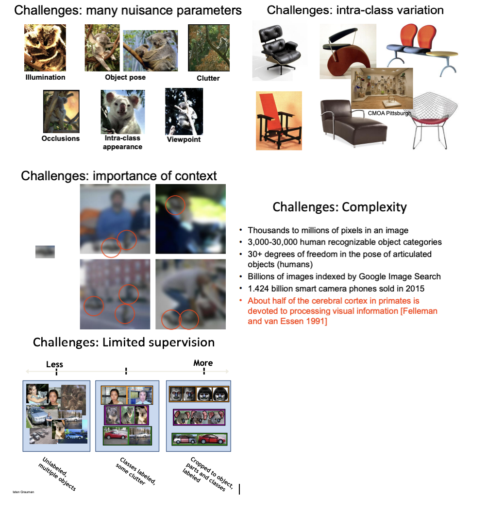

Algorithm be able to recognize and understand the object, human.

Although vision presents multi-tasks, there many challenges: illumination, object pose, clutter, occlusions, intra-class apprearance, viewpoint,etc

Research Paper: Make-A-Scene: Scene-Based Text-to-Image Generation with Human Priors (https://www.ecva.net/papers/eccv_2022/papers_ECCV/papers/136750087.pdf) ECCV 2022

### [GPT models families] Interacted with pretrained models in two ways

- Sample from the distributions they define (providing a prompt)
- Fine-tune them on a task we care about, and take their predictions
- Format inputs to our decoder for finetuning tasks

